# MvpMatchCodeChallenge

## Introduction

This project is a code challenge designed as part of an interview process.

It consists of a simple Elixir/Phoenix application that simulates a vending machine. The application allows users with a "seller" role to add, update, or remove products. Meanwhile, users with a "buyer" role can deposit coins into the machine and make purchases. The vending machine is programmed to accept only 5, 10, 20, 50, and 100 cent coins.

The app provides both an API and a user interface (UI) to manage these functionalities.

### Used technologies

- Elixir
- Phoenix
- TailwindCSS
- PostgreSQL
- Docker

## Running the App

Clone the repository and navigate to the project directory:

```bash
git clone https://github.com/mansour-ahmed/mvp_match_code_challenge
cd mvp_match_code_challenge
```

### With Docker

If you don't have Elixir installed, you can run the app using Docker and Docker Compose. Ensure that Docker and Docker Compose are installed on your machine.

1. Build and start the Docker containers:

```bash
docker-compose up --build
```

The app's UI will be accessible at `http://localhost:4000` & API endpoints at `http://localhost:4000/api`.

### With Elixir

If you have Elixir installed, you can run the app directly on your machine.

1. Start the PostgreSQL service:

```bash
docker-compose up postgres -d
```

2. Install the dependencies:

```bash
mix deps.get
```

3. Create and migrate the database:

```bash
mix ecto.setup
```

4. Start the Phoenix server:

```bash
mix phx.server
```

The app's UI will be accessible at `http://localhost:4000` & API endpoints at `http://localhost:4000/api`.

## Tests & Code Quality

The app has **194** tests. To run the tests using Elixir: `mix test`.

The app also includes the code quality tools:

- Sobelow: security-focused static analysis.
- Credo: static code quality analysis.
- mix_audit: scan Mix dependencies for security vulnerabilities.
- Dialyxir: to enable Erlang's Dialyzer.

To run all of the above: `mix check`.

## Directory structure

The app uses a standard Phoenix directory structure. For more details, refer to the [Phoenix documentation](https://hexdocs.pm/phoenix/directory_structure.html).

## Test User Credentials

For testing purposes, the following user accounts have been created in the development environment:

1. **Buyer User**

- Username: `user_buyer`
- Password: `Hello world!`
- Role: Buyer
- Deposit: 1000

2. **Seller User**

- Username: `user_seller`
- Password: `Hello world!`
- Role: Seller

You can use these credentials to log in and test various functionalities of the application.

All API endpoints require authentication unless otherwise mentioned. To obtain an API token, send a POST request to `http://localhost:4000/api/session/token` with valid credentials like this:

```json
{
  "username": "user_buyer",
  "password": "Hello world!"
}
```

Once obtained, you can attach the API token in the authorization header as `Authorization: Bearer $YOUR_API_TOKEN` for subsequent requests.

## API Endpoints

Here are all available API endpoints:

### Session

- **POST `/api/session/token`**: Generate an API token (Public endpoint).

  - Payload example

  ```json
  {
    "username": "user_seller",
    "password": "Hello world!"
  }
  ```

- **DELETE `/api/session/log_out/all`**: Log out of all sessions.

### Users

- **POST `/api/users/`**: Create a new user (Public endpoint).

  - Payload example

  ```json
  {
    "username": "user_seller",
    "password": "Hello world!",
    "role": "seller",
    "deposit": 100
  }
  ```

- **GET `/api/users/:id`**: Get user details.
- **DELETE `/api/users/:id`**: Delete a user.

### Deposits

- **PUT `/api/users/:id/deposit/reset`**: Reset user's deposit (Buyers only).
- **POST `/api/users/:id/deposit/:coin`**: Add given coin to user's deposit (Buyers only). You can add only one coin at a time.

### Products

- **GET `/api/products/`**: List all products (Public endpoint).
- **GET `/api/products/:id`**: Get product details (Public endpoint).
- **POST `/api/products/`**: Create a product (Sellers only).
- Payload example:

  ```json
  {
    "cost": 5,
    "amount_available": 10,
    "product_name": "best product"
  }
  ```

- **PUT `/api/products/:id`**: Update a product (Product's seller only).
- Payload example

  ```json
  {
    "cost": 500
  }
  ```

- **DELETE `/api/products/:id`**: Delete a product (Product's seller only).
- **POST `/api/products/:id/buy`**: Buy a product (Buyers only).
- Payload example

  ```json
  {
    "transaction_product_amount": 2
  }
  ```

## Frontend UI

### Landing Page

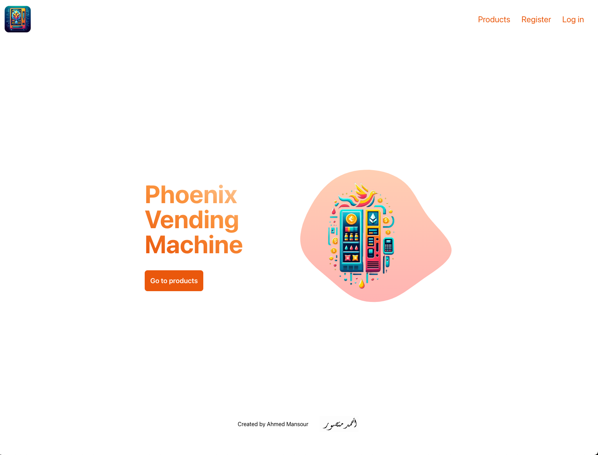

- Path: `/`
- Public page.

### User Registration Page

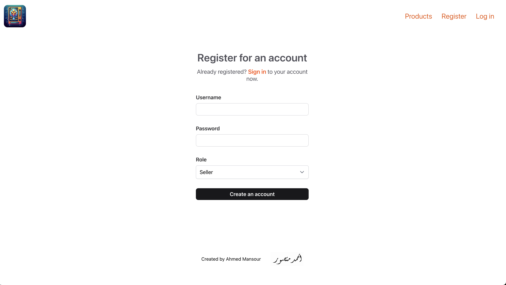

- Allows new users to register.
- Path: `/users/register`
- Public page.

### User Login Page

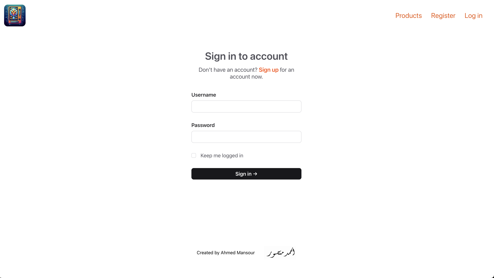

- Allows users to log in.
- Path: `/users/log_in`
- Public page.

### User Settings Page

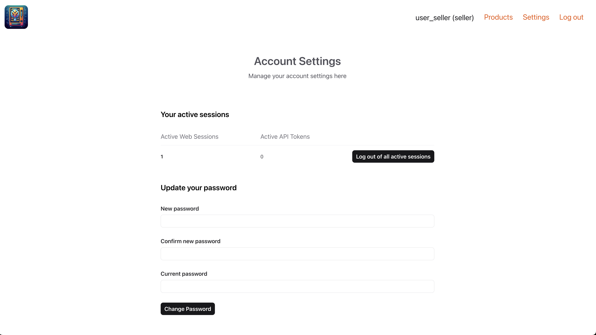

- Allows users to view and edit their settings.
- Path: `/users/settings`

### Products Page

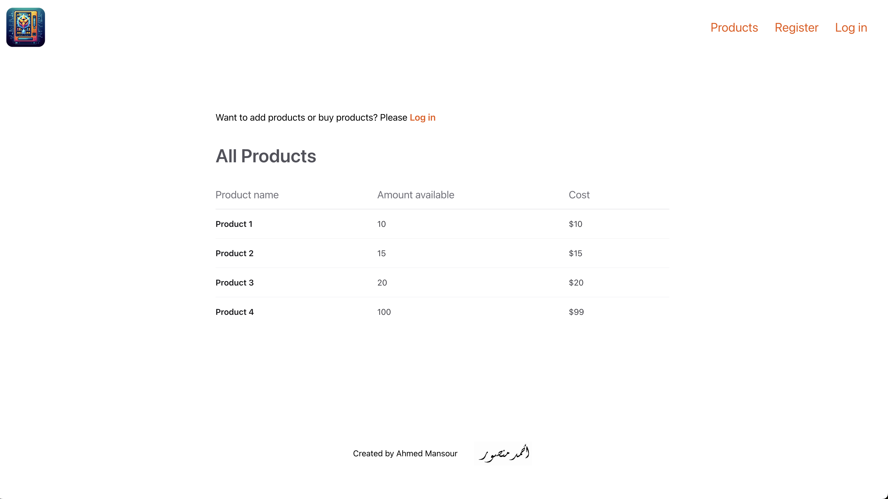

- Lists all products.
- Path: `/products`
- Public page.

### Product Detail Page

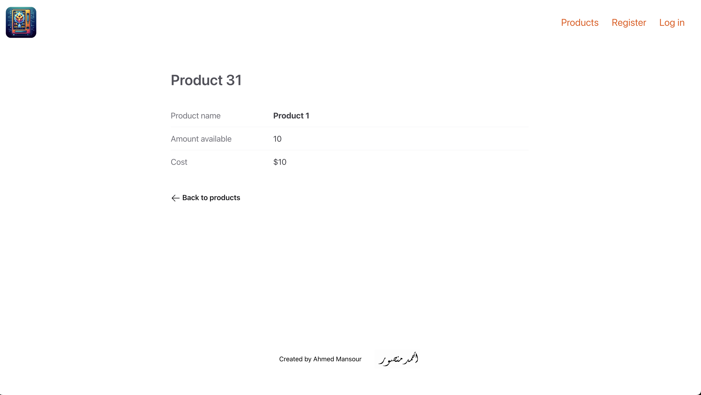

- Shows detailed information about a specific product.
- Path: `/products/:id`
- Public page.

### New Product Page

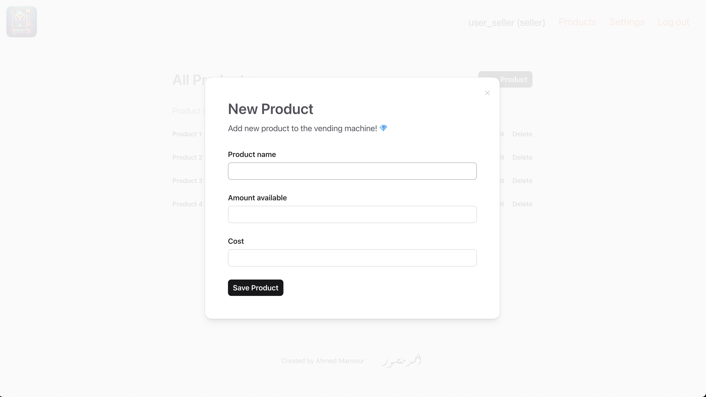

- Allows sellers to create new products.
- Path: `/products/new`

### Buyer View

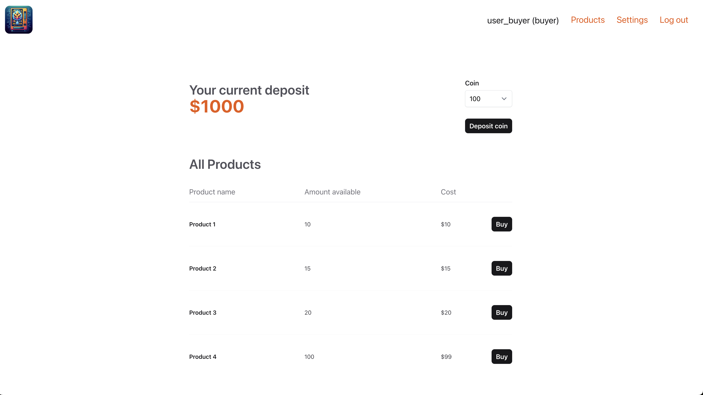
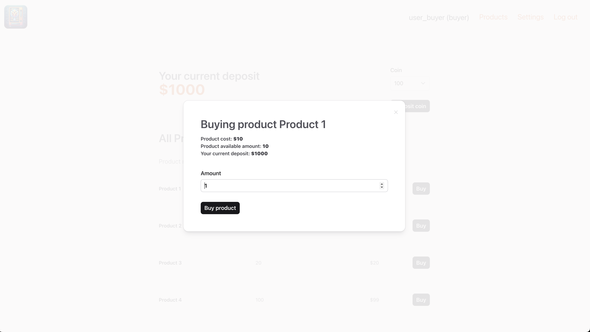
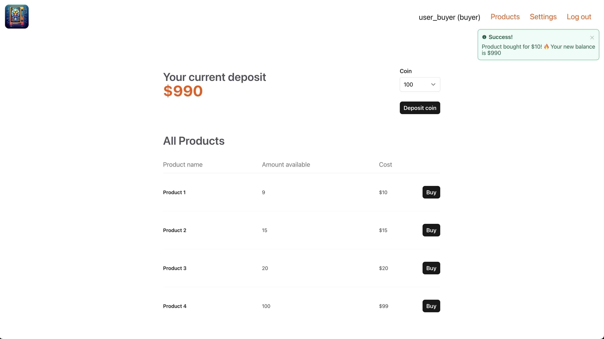

### Seller View

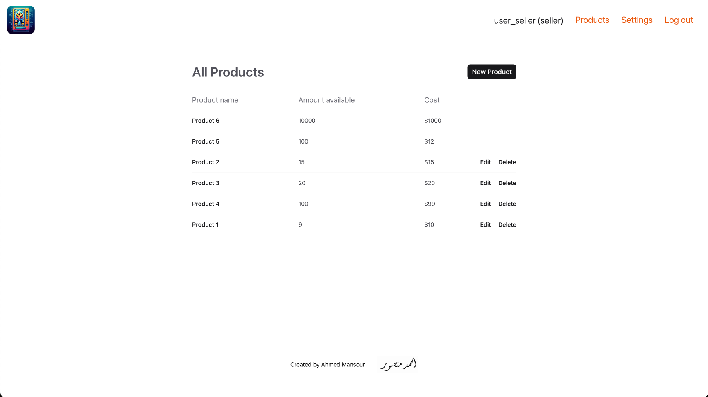
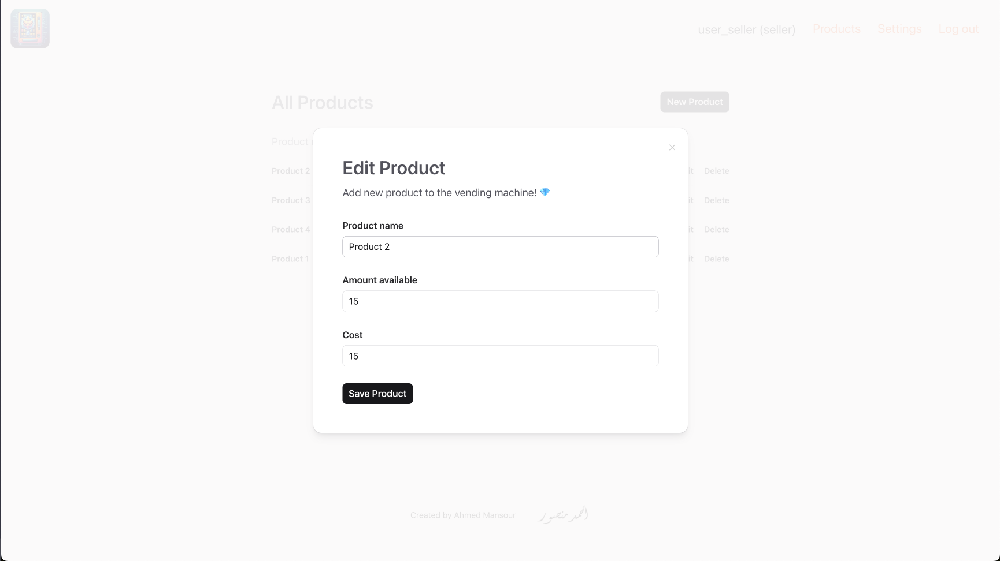

## License

MIT
